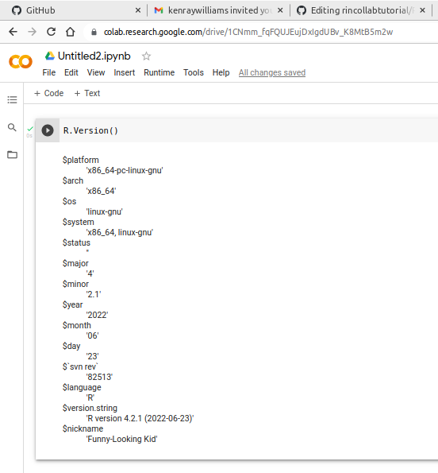
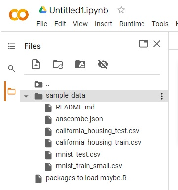
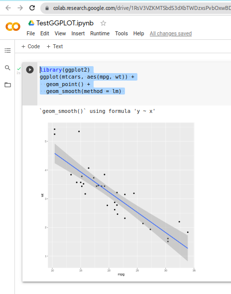

# Basic Tutorial on How to Use R in Google Colab

- **Authors:**

&nbsp;&nbsp;&nbsp;&nbsp;&nbsp;&nbsp;&nbsp;&nbsp;&nbsp;&nbsp;&nbsp;&nbsp;Kendal Raymond William Smith <100494805@alumnos.uc3m.es>

&nbsp;&nbsp;&nbsp;&nbsp;&nbsp;&nbsp;&nbsp;&nbsp;&nbsp;&nbsp;&nbsp;&nbsp;Germán Blanco Blanco <100441287@alumnos.uc3m.es>
- **Date:**

&nbsp;&nbsp;&nbsp;&nbsp;&nbsp;&nbsp;&nbsp;&nbsp;&nbsp;&nbsp;&nbsp;&nbsp;September 26th, 2022

## Introduction

Google Colab or Google Colaboratory is an online free tool provided by Google.
This tool gives access to some computer resources, including GPU hardware, to anybody with just a Google account, internet access and a browser.
The idea is to use this available computer power through notebooks and it is focused on data analysis and machine learning tasks.
It is primarily intended for Python code, but it is also possible to use this tool with the R programming language.
This short tutorial provides a simple step by step guide on how to run R code in Google Colab.
Even though there is a way to use the rpy2 Python package and use run through the Python interpreter, this tutorial focuses on the direct use of the R runtime.

## Step by Step

### 1. Connect to the Internet and open your favourite browser
The current tutotorial has been prepared using the latest version of Google Chrome and it might make sense to recommend the use of that browser since it is developed by the same company that provides the Colab tool.
### 2. Sign-in to a Google account
Without a Google Account an error window stating 'Google sign-in required'  will be shown.
In any case, most people would like to keep their work from one session to the next and have the capacity of sharing notebooks with others.
### 3. Go to the Google Colab Site
Use the url [https://colab.to/r](https://colab.to/r).
An empty notebook will automaticall be opened.
Try a sample R code line, e.g. `test <- 123` and hit the play button on the left, "Runtime->Run the focused cell" in the menu, or simply by pressing CTRL+ENTER while the text cursor is on the line to be run.
The numeric variable test will be created with value $123$.
It is possible to verify the value of the variable by typing the input "test" and running the cell again.
Let's check the version that we are using by typing "R.version()" and running the cell:



### 4. Uploading files
It is also possible to upload files such as datasets by clicking the folder icon (called "Files") on the left hand pane and clicking the upload button (called "Upload to session storage") button. This could be useful if you wish to add your own data, but you must save it (or download it) again before the session is over to prevent it from being lost.



### 5. Plotting
Lastly, let us test how plots are shown using this platform.
Let's try the following code:
```
library(ggplot2)
ggplot(mtcars, aes(mpg, wt)) +
  geom_point() +
  geom_smooth(method = lm) 
```
The result is the following:



So we can see that plots are also nicely integrated within the notebook.

## Conclusion

Google Colab provides very easy access to a R runtime environment.

## Sources

[Google Colab](https://colab.research.google.com/)

[How to use R in Google Colab](https://towardsdatascience.com/how-to-use-r-in-google-colab-b6e02d736497)

[The R Project for Statistical Computing](https://www.r-project.org/)
